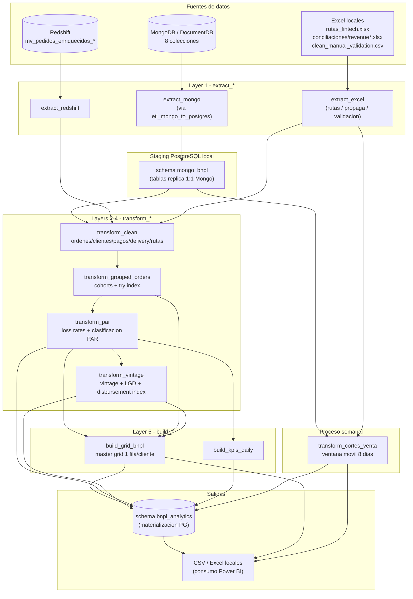
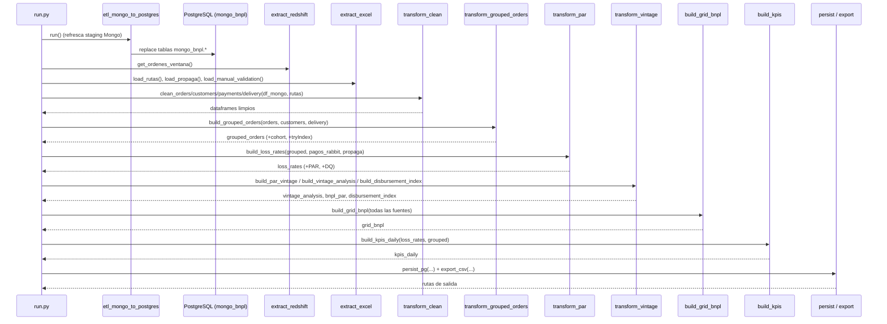
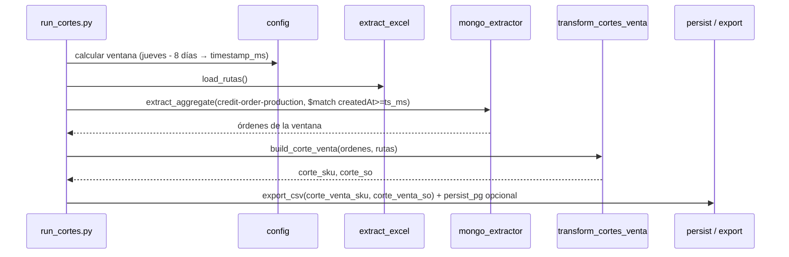

# Documento de Diseño: Migración Pipeline BNPL

> ## ⚠️ Documento parcialmente superado — leer primero `plan_implementacion.md`
>
> La arquitectura por capas y la correspondencia legacy → módulos siguen vigentes. Pero este
> documento se escribió **antes** de verificar las fuentes reales (2026-08-11/12) y varias
> afirmaciones resultaron falsas. Lo que quedó desmentido:
>
> | Este documento dice | La realidad |
> |---|---|
> | `payment-report` tiene `status` | se llama `state`; el que usa el negocio es `transactionStatus` |
> | `state-of-delivery` tiene `salesOrderId` | el sales order viene en `orderId` |
> | `fintech-credit-approval` tiene `approvalDate` | es `createdAt` (string ISO) |
> | `enrollmentChannel` en approval | es `origin` |
> | `latitude`/`longitude` en `fintech-customers` | viven en `fintech-credit-request` |
> | colección `fintech-pre-authorization-status` | es `...-status-production` (62,334 docs) |
> | buckets PAR: Current / DQ 0-29 / 30-59 / 60-89 / 90+ | son Paid / Ongoing / DQ 1-6 / 7-14 / 15-29 / 30-59 / 60-89 / 90+ |
> | `expectedPaymentDate = deliveryAt + 15d` | además **se mueve al lunes** si cae en fin de semana |
> | schema `bnpl_analytics` | se usa `bnpl` |
> | rutas desde `rutas_fintech.xlsx` | desde Redshift; el Excel ya no existe en el proyecto |
> | `revenue-orders` para conciliar revenue | descartada: 48% de filas vacías y montos corruptos |
>
> Los Riesgos 1 a 4 y las Decisiones 5 y 6 del final siguen abiertos, y están consolidados en
> `PENDIENTES_NEGOCIO.md` (raíz del proyecto).

## Overview

El pipeline BNPL (Buy Now Pay Later) de Rabbit hoy vive en dos notebooks Jupyter monolíticos (`Buy Now Pay Later Robot.ipynb` y `Cortes de Venta.ipynb`) con credenciales en texto plano y ejecución manual. Este diseño migra ese proceso completo a la arquitectura modular de scripts Python ya establecida en el repo (patrón `analisis_one_shot/`): extracción Mongo→PostgreSQL local vía `mongo_extractor` + `etl_mongo_to_postgres.py`, extracción Redshift vía `redshift_extractor`, y módulos separados `extract_* / transform_* / build_* / export` orquestados por un `run.py`.

El alcance cubre los dos procesos del pipeline:

1. **Robot de riesgo** (mensual / por demanda): limpieza de fuentes, agrupación de órdenes y cohorts, cálculo de PAR y loss rates, vintage analysis con proyección de LGD, master grid por cliente (`grid_bnpl`) y KPIs diarios.
2. **Cortes de venta** (semanal): ventana móvil de ~8 días desde jueves, extracción incremental de órdenes y agregación por SKU y por Sales Order.

El diseño respeta las reglas del proyecto: **SQLAlchemy solo Core**, inserts idempotentes con `ON CONFLICT DO NOTHING`, credenciales **siempre** desde `.env`, y ninguna feature no solicitada. Las fechas mágicas de las reglas de intereses y la ventana temporal se externalizan como constantes/parámetros de configuración, no se incrustan en `np.where`. La sección final documenta explícitamente las decisiones y riesgos abiertos que deben resolverse antes de implementar.

## Architecture

### Vista general por capas



### Correspondencia legacy → módulos nuevos

| Función legacy (notebook) | Módulo nuevo | Función principal |
|---|---|---|
| `extraer_ordenes()` | `transform_clean.py` | `clean_orders()` |
| `limpiar_rutas()` | `extract_excel.py` | `load_rutas()` |
| `extraer_clientes()` | `transform_clean.py` | `clean_customers()` |
| `extraer_pagos()` | `transform_clean.py` | `clean_payments()` |
| `extraer_delivery()` | `transform_clean.py` | `clean_delivery()` |
| `cargar_propaga()` | `extract_excel.py` | `load_propaga()` |
| `agrupar_ordenes()` | `transform_grouped_orders.py` | `build_grouped_orders()` |
| `calcular_par()` | `transform_par.py` | `build_loss_rates()` |
| `calcular_par_vintage()` | `transform_vintage.py` | `build_par_vintage()` |
| `calcular_vintage()` | `transform_vintage.py` | `build_vintage_analysis()` |
| `loan_disbursement_index()` | `transform_vintage.py` | `build_disbursement_index()` |
| `construir_grid_bnpl()` | `build_grid_bnpl.py` | `build_grid_bnpl()` |
| `kpis_diarios()` | `build_kpis.py` | `build_kpis_daily()` |
| Notebook Cortes de Venta | `transform_cortes_venta.py` | `build_corte_venta()` |

### Estructura de archivos propuesta

Se crea un paquete hermano de `analisis_one_shot/`, siguiendo el mismo patrón:

```
robot_bnpl/
├── run.py                       ← Orquestador robot de riesgo (mensual/por demanda)
├── run_cortes.py                ← Orquestador cortes de venta (semanal)
├── config.py                    ← Conexiones (.env), rutas, constantes de negocio
├── extract_redshift.py          ← Órdenes Rabbit desde Redshift
├── extract_excel.py             ← rutas_fintech / propaga / clean_manual_validation
├── transform_clean.py           ← Layer 1: limpieza órdenes/clientes/pagos/delivery
├── transform_grouped_orders.py  ← Layer 2: agrupación + cohorts + try index
├── transform_par.py             ← Layer 3: loss rates + clasificación PAR
├── transform_vintage.py         ← Layer 4: vintage + LGD + disbursement index
├── build_grid_bnpl.py           ← Layer 5: master grid por cliente
├── build_kpis.py                ← Layer 5: KPIs diarios
├── transform_cortes_venta.py    ← Proceso semanal cortes de venta
├── persist.py                   ← Escritura idempotente a PG (schema bnpl_analytics)
├── export.py                    ← CSV / Excel para Power BI
└── README.md
```

`etl_mongo_to_postgres.py` (raíz) se **extiende** (no se duplica) para cubrir los campos que el robot necesita y que hoy no se proyectan (ver sección Data Models → gaps de extracción).

### Diagrama de secuencia — Robot de riesgo



### Diagrama de secuencia — Cortes de venta (semanal)



## Components and Interfaces

Todas las firmas usan Python + pandas + SQLAlchemy Core. Los extractores de conexión (`redshift_extractor`, `mongo_extractor`) son librerías internas ya existentes. Los `netsuite_id` y `sales_order_id` se normalizan siempre a `str.strip()` (consistente con el patrón actual). Cada módulo del paquete `robot_bnpl/` expone funciones puras (entrada/salida DataFrame) salvo `config`, `persist`, `export` y los orquestadores `run` / `run_cortes`. SQLAlchemy se usa **solo Core** (`text()`, `engine.begin()`), nunca ORM.

### config.py

Centraliza conexiones (desde `.env`), rutas de entrada/salida y **constantes de negocio** (fechas mágicas externalizadas, no incrustadas en `np.where`). Reemplaza el hardcodeo de `PG_URL` que hoy existe en `analisis_one_shot/config.py`.

```python
from pathlib import Path
import os
from dotenv import load_dotenv

load_dotenv(".env")

# ── Conexiones (SIEMPRE desde .env, nunca hardcodeadas) ──────────────
PG_URL      = os.environ["BD_ENGINE_RABBIT_LOCAL"].strip("'\"")
REDSHIFT_DB = os.environ.get("REDSHIFT_DB", "data-rabbit-prod")
MONGO_ALIAS = os.environ.get("MONGO_ALIAS", "bnpl")

# ── Schemas ──────────────────────────────────────────────────────────
STAGING_SCHEMA   = "mongo_bnpl"       # replica 1:1 de Mongo (poblado por ETL)
ANALYTICS_SCHEMA = "bnpl_analytics"   # tablas transform_* materializadas (propuesto)

# ── Rutas ────────────────────────────────────────────────────────────
BASE_DIR   = Path(__file__).parent
INPUT_DIR  = BASE_DIR.parent / "data" / "input"
OUTPUT_DIR = BASE_DIR / "output"
RUTAS_XLSX          = INPUT_DIR / "rutas_fintech.xlsx"
PROPAGA_DIR         = INPUT_DIR / "conciliaciones"
MANUAL_VALIDATION   = INPUT_DIR / "clean_manual_validation.csv"

# ── Constantes de negocio (antes fechas mágicas en np.where) ─────────
CREDIT_TERM_DAYS = 15          # expectedPaymentDate = deliveryAt + 15 días
EPOCH_TZ_OFFSET_HOURS = -6     # epoch → datetime hora México

# Cortes de reglas de intereses (documentados, parametrizables)
INTEREST_RULE_CUTOFFS = {
    "cutoff_1": "2024-04-22",
    "cutoff_2": "2024-09-01",
    "cutoff_3": "2024-10-13",
}

# Buckets de morosidad (PAR)
DQ_BUCKETS = [
    ("Current",  None, 0),     # pagado a tiempo / sin atraso
    ("DQ 0-29",  1, 29),
    ("DQ 30-59", 30, 59),
    ("DQ 60-89", 60, 89),
    ("DQ 90+",   90, None),
    # "Unpaid" se asigna cuando no hay pago registrado
]

# Cortes de venta: ventana móvil
CORTE_WINDOW_DAYS = 8
CORTE_ANCHOR_WEEKDAY = 3       # jueves (0=lunes)
```

### extract_redshift.py

**Propósito**: órdenes Rabbit desde Redshift para la ventana del robot (reutiliza el patrón de ventana "meses cerrados" de `analisis_one_shot`; SQL parametrizado por fechas, sin credenciales embebidas, vía `redshift_extractor.extract_sql`).

```python
def get_ordenes_ventana(meses: int = 6) -> pd.DataFrame:
    """Órdenes Redshift de los últimos `meses` cerrados.
    Granularidad: 1 fila por (netsuite_id, sales_order_id, fecha_creacion).
    Columnas: netsuite_id (str), sales_order_id (str), fecha_creacion (date),
              monto_venta (float)."""
```

### extract_excel.py

**Propósito**: cargar las fuentes locales. Maneja el caso de archivo bloqueado por Excel (patrón `PermissionError → copia temporal`, ya usado en el repo).

```python
def load_rutas() -> pd.DataFrame:
    """rutas_fintech.xlsx → rutas limpias.
    Dedup por netsuite_id. Clasifica tipo: 'organico' | 'aliado'.
    Columnas: netsuite_id (str), preventa, supervisor, oficina, tipo."""

def load_propaga() -> pd.DataFrame:
    """Concatena conciliaciones/revenue*.xlsx (pagos Propaga).
    Rename Client_ID → netsuite_id.
    Columnas: netsuite_id (str), movement_date (date), total_amount (float),
              propaga_credit_id."""

def load_manual_validation() -> pd.DataFrame:
    """clean_manual_validation.csv → validación manual por cliente.
    Columnas: netsuite_id (str), validacion_manual."""
```

### transform_clean.py — Layer 1

```python
def clean_orders(df_orders: pd.DataFrame, df_rutas: pd.DataFrame) -> pd.DataFrame:
    """credit_order_production limpio.
    - createdAt / deliveryAt: epoch → datetime con offset EPOCH_TZ_OFFSET_HOURS.
    - merge con rutas por netsuite_id.
    Salida (bnpl_clean_history_orders): netsuiteId, salesOrderId, orderId,
      createdAt, deliveryAt, orderGrossSales, quantity, skus, orderStatus,
      salesChannel, category, brand, subcategory, ruta, supervisor, oficina, tipo."""

def clean_customers(df_customers: pd.DataFrame,
                    df_credit_request: pd.DataFrame) -> pd.DataFrame:
    """fintech-customers + credit-request.
    - rename name → shopName.
    - edad = derivada de birthdate.
    - genero = inferencia gender_guesser sobre shopName/nombre.
    Salida (bnpl_clean_customers_onboarding): netsuiteId, customerId, shopName,
      phoneNumber, birthdate, edad, genero, latitude, longitude."""

def clean_payments(df_payments: pd.DataFrame) -> pd.DataFrame:
    """payment-report-production.
    - clientId → netsuiteId.
    - movementDate ms → fecha %Y-%m-%d.
    Salida (bnpl_clean_history_payments): netsuiteId, creditId, movementDate,
      totalAmount, paymentDateFromToPay, paymentDateFromPaid, status."""

def clean_delivery(df_delivery: pd.DataFrame) -> pd.DataFrame:
    """state-of-delivery-report.
    - clientId → netsuiteId, status → deliveryStatus.
    Salida (bnpl_clean_state_of_delivery): netsuiteId, salesOrderId,
      deliveryStatus, deliveryDate."""
```

### transform_grouped_orders.py — Layer 2

```python
def build_grouped_orders(df_orders: pd.DataFrame,
                         df_customers: pd.DataFrame,
                         df_delivery: pd.DataFrame) -> pd.DataFrame:
    """Agrupa a nivel (netsuiteId, salesOrderId).
    - agg: createdAt(max), orderGrossSales(sum), skus(nunique), quantity(sum).
    - customerOrderTryIndex: rank de pedidos por cliente (1º, 2º, 3º...).
    - enrollment_cohort: primer createdAt del cliente (truncado a mes).
    Salida (bnpl_grouped_orders): netsuiteId, salesOrderId, orderId,
      enrollment_cohort, customerOrderTryIndex, createdAt, deliveryAt,
      orderStatus, orderGrossSales, salesChannel, ruta, oficina, deliveryStatus."""
```

### transform_par.py — Layer 3

```python
def build_loss_rates(df_grouped: pd.DataFrame,
                     df_pagos_rabbit: pd.DataFrame,
                     df_propaga: pd.DataFrame) -> pd.DataFrame:
    """Join grouped_orders + pagos Rabbit + Propaga; calcula PAR por orden.
    - expectedPaymentDate = deliveryAt + CREDIT_TERM_DAYS.
    - daysDelinquent y bucket PAR (ver classify_par).
    - everActivatedCustomers por cohort.
    - monthsFromEnrollmentToMonth.
    Salida (bnpl_loss_rates): netsuiteId, enrollment_cohort, month, createdAt,
      deliveryAt, expectedPaymentDate, PAR, daysDelinquent, DQ,
      rabbit_totalAmount, rabbit_paymentDateFromPaid, propaga_totalAmount,
      propaga_movementDate, everActivatedCustomers, monthsFromEnrollmentToMonth."""

def classify_par(days_delinquent: float | None, has_payment: bool) -> str:
    """Clasifica una orden en un bucket PAR según DQ_BUCKETS.
    Retorna 'Unpaid' si no hay pago y venció; 'Current' si al día."""
```

### transform_vintage.py — Layer 4

```python
def build_par_vintage(df_loss_rates: pd.DataFrame) -> tuple[pd.DataFrame, pd.DataFrame]:
    """Groupby (enrollment_cohort, monthsFromEnrollmentToMonth).
    - agg: count, sum(totalAmount), countDQ30, countDQ60, countDQ90.
    Retorna (bnpl_par, months_closes)."""

def build_vintage_analysis(df_par: pd.DataFrame,
                           df_months_closes: pd.DataFrame) -> pd.DataFrame:
    """Evolución PAR mes a mes por cohort + proyección LGD.
    Salida (vintage_analysis): enrollment_cohort, monthsFromEnrollmentToMonth,
      PAR distribution, LGD projection."""

def build_disbursement_index(df_loss_rates: pd.DataFrame) -> pd.DataFrame:
    """Rank por customerOrderTryIndex (1er crédito ≠ recompra).
    Salida (loan_disbursement_index): netsuiteId, enrollment_cohort,
      disbursement_index."""
```

### build_grid_bnpl.py — Layer 5

```python
def build_grid_bnpl(df_preauth: pd.DataFrame,
                    df_approval: pd.DataFrame,
                    df_customers: pd.DataFrame,
                    df_grouped: pd.DataFrame,
                    df_payments: pd.DataFrame,
                    df_loss_rates: pd.DataFrame,
                    df_manual: pd.DataFrame) -> pd.DataFrame:
    """Master grid: 1 fila por cliente.
    - pre-autorizados (fintech-pre-authorization-status).
    - aprobados: creditLimit, enrollmentChannel (fintech-credit-approval).
    - clientes: shopName, ruta, oficina.
    - órdenes agrupadas: conteos (completas/canceladas/rechazadas).
    - pagos: count, suma, última fecha.
    - validación manual (clean_manual_validation).
    - bnplIsActivated: tiene ≥1 orden activa.
    - bnplIsActive: última actividad ≤ 30 días.
    Salida (grid_bnpl): 1 fila por netsuiteId con todos los campos anteriores."""
```

### build_kpis.py — Layer 5

```python
def build_kpis_daily(df_loss_rates: pd.DataFrame,
                     df_grouped: pd.DataFrame) -> pd.DataFrame:
    """KPIs diarios.
    - groupby createdAt: count_ordenes, sum_ventas.
    - groupby deliveryAt: count_entregas.
    - groupby paymentDate: count_pagos, sum_pagos.
    Salida (bnpl_kpis_daily): fecha, count_ordenes, sum_ventas, count_entregas,
      count_pagos, sum_pagos."""
```

### transform_cortes_venta.py — Proceso semanal

```python
def compute_window(anchor: date | None = None) -> tuple[datetime, int]:
    """Ventana móvil: retrocede a CORTE_ANCHOR_WEEKDAY (jueves) y toma
    CORTE_WINDOW_DAYS días. Retorna (timestamp_inicio, timestamp_ms)."""

def build_corte_venta(df_orders: pd.DataFrame,
                      df_rutas: pd.DataFrame) -> tuple[pd.DataFrame, pd.DataFrame]:
    """Órdenes de la ventana ($match createdAt >= timestamp_ms en Mongo).
    - groupby SO + merge rutas.
    Retorna (corte_venta_sku, corte_venta_so)."""
```

### persist.py y export.py

```python
def persist_pg(df: pd.DataFrame, table: str, conflict_cols: list[str]) -> None:
    """Escribe df en ANALYTICS_SCHEMA.table con SQLAlchemy Core.
    Crea el schema si no existe. Inserts idempotentes:
    INSERT ... ON CONFLICT (conflict_cols) DO NOTHING."""

def export_csv(df: pd.DataFrame, name: str, encoding: str = "utf-8") -> Path:
    """Escribe CSV en OUTPUT_DIR para consumo Power BI.
    (Nota: legacy usaba latin1 — ver decisión pendiente sobre encoding.)"""
```

### run.py / run_cortes.py — Orquestadores

```python
def run():                                    # robot de riesgo
    etl_mongo_to_postgres.run()               # refresca staging mongo_bnpl
    orders   = extract_redshift.get_ordenes_ventana(historico)
    rutas, propaga, manual = extract_excel.load_rutas(), load_propaga(), load_manual_validation()
    clean    = transform_clean.*(...)         # orders/customers/payments/delivery
    grouped  = transform_grouped_orders.build_grouped_orders(...)
    loss     = transform_par.build_loss_rates(...)
    vintage  = transform_vintage.*(...)       # par_vintage/vintage_analysis/disbursement_index
    grid     = build_grid_bnpl.build_grid_bnpl(...)
    kpis     = build_kpis.build_kpis_daily(...)
    persist.persist_pg(...); export.export_csv(...)

def run_cortes():                             # cortes de venta semanal
    ts_inicio, ts_ms = transform_cortes_venta.compute_window()
    rutas   = extract_excel.load_rutas()
    ordenes = mongo_extractor.extract_aggregate(
        MONGO_ALIAS, "credit-order-production",
        [{"$match": {"createdAt": {"$gte": ts_ms}}}])
    corte_sku, corte_so = transform_cortes_venta.build_corte_venta(ordenes, rutas)
    export.export_csv(...); persist.persist_pg(...)  # persist opcional
```

## Data Models

### Capa staging — schema `mongo_bnpl` (PostgreSQL local `rabbit_fintech_bi`)

Réplica 1:1 de las colecciones Mongo generada por `etl_mongo_to_postgres.py` (`to_sql(..., if_exists="replace")`). Estado actual de proyección y gaps por tabla:

| Tabla | Colección Mongo | Campos hoy proyectados | Gap para el robot |
|---|---|---|---|
| `credit_order_production` | credit-order-production | createdAt, netsuiteId, salesOrderId, orderId, totalPriceFinal, orderGrossSales, quantity, productId, productDescription, category, brand, subcategory, vendor, iva, ieps, couponCode, couponValue, orderStatus, salesChannel, shortId, deliveryAt | Completo para robot y cortes |
| `payment_report_production` | payment-report-production | clientId, creditId, movementDate, paymentDateFromToPay, paymentDateFromPaid, totalAmount, status | Completo |
| `fintech_customers_production` | fintech-customers-production | netsuiteId, shopName (←name), phoneNumber, latitude, longitude | Completo |
| `fintech_credit_request_production` | fintech-credit-request-production | customerId, birthdate, phoneNumber | Completo (edad/genero se derivan en transform) |
| `fintech_credit_approval_production` | fintech-credit-approval-production | netsuiteId, approvalDate, creditLimit | **Falta `enrollmentChannel`** (usado por grid). Extender proyección. |
| `fintech_pre_authorization_status` | fintech-pre-authorization-status | netsuiteId, preAuthorizationDate, status | **Verificar nombre de colección** (ver Riesgos) y agregar `originalCreditLimit` |
| `state_of_delivery_report_production` | state-of-delivery-report-production | netsuiteId (←clientId), salesOrderId, deliveryStatus (←status), deliveryDate | Completo |
| `revenue_orders_production` | revenue-orders-production | transactionId, fintechStatus | Verificar si se requiere `netsuiteId` / `status = APPROVED` para conciliación Propaga |

### Gaps de extracción (el ETL actual NO proyecta — el robot los necesita)

`etl_mongo_to_postgres.py` debe **extenderse** (no duplicarse) para agregar estos campos a los `$project` correspondientes:

| Colección / tabla | Campo faltante | Uso en el robot |
|---|---|---|
| `fintech-credit-approval-production` | `enrollmentChannel` | canal de enrolamiento para `grid_bnpl` |
| `fintech-pre-authorization-status` | `originalCreditLimit` | línea de crédito original para `grid_bnpl` (distinta de `creditLimit` vigente) |
| `revenue-orders-production` | filtrar / proyectar `status = APPROVED` | conciliación de revenue aprobado; hoy solo trae `fintechStatus` |
| `credit-order-production` | `productId`, `category`, `brand`, `skus` | cortes de venta por SKU y análisis de mezcla de producto |

> Nota: `credit-order-production` ya proyecta `productId`, `category`, `brand` en el ETL actual; confirmar que `skus` (arreglo de líneas) se está aplanando correctamente por `_flatten()` (se serializa a JSON si es lista). Si el corte requiere 1 fila por SKU, la explosión del arreglo se hace en `transform_cortes_venta`.
>
> **Acción de extracción**: extender `COLLECTIONS` en `etl_mongo_to_postgres.py` para agregar `enrollmentChannel` a la aprobación y confirmar el resto. No se crea un ETL nuevo.

### Capa analytics — schema `bnpl_analytics` (materialización propuesta)

Escritura idempotente vía `persist.persist_pg` (`ON CONFLICT DO NOTHING`). Cada salida del robot se materializa como tabla en PG (además del CSV) para reproducibilidad y consumo directo desde Power BI. Clave de conflicto para idempotencia entre paréntesis.

| Tabla PG / CSV | Grano | Columnas clave | Conflict key |
|---|---|---|---|
| `bnpl_clean_history_orders` | orden-SKU | netsuiteId, salesOrderId, orderId, createdAt, deliveryAt, orderGrossSales, quantity, ruta, oficina, tipo | (orderId, productId) |
| `bnpl_clean_customers_onboarding` | cliente | netsuiteId, customerId, shopName, edad, genero, lat, lon | (netsuiteId) |
| `bnpl_clean_history_payments` | pago | netsuiteId, creditId, movementDate, totalAmount, status | (creditId, movementDate) |
| `bnpl_clean_state_of_delivery` | orden | netsuiteId, salesOrderId, deliveryStatus, deliveryDate | (salesOrderId) |
| `bnpl_grouped_orders` | netsuiteId+SO | enrollment_cohort, customerOrderTryIndex, createdAt, deliveryAt, orderGrossSales, deliveryStatus | (netsuiteId, salesOrderId) |
| `bnpl_loss_rates` | orden | enrollment_cohort, expectedPaymentDate, PAR, daysDelinquent, DQ, rabbit_totalAmount, propaga_totalAmount, monthsFromEnrollmentToMonth | (netsuiteId, salesOrderId) |
| `bnpl_par` | cohort+mes | enrollment_cohort, monthsFromEnrollmentToMonth, count, sum_amount, countDQ30/60/90 | (enrollment_cohort, monthsFromEnrollmentToMonth) |
| `months_closes` | cohort | enrollment_cohort, meses cerrados | (enrollment_cohort) |
| `vintage_analysis` | cohort+mes | PAR distribution, LGD projection (usa `LGD_SUPUESTO`) | (enrollment_cohort, monthsFromEnrollmentToMonth) |
| `loan_disbursement_index` | cliente | enrollment_cohort, disbursement_index | (netsuiteId) |
| `grid_bnpl` | cliente | shopName, ruta, oficina, PAR, DQ, conteos órdenes, suma pagos, credit_limit, original_credit_limit, bnplIsActivated, bnplIsActive, validacion_manual | (netsuiteId) |
| `bnpl_kpis_daily` | fecha | count_ordenes, sum_ventas, count_entregas, count_pagos, sum_pagos | (fecha) |
| `corte_venta_sku` | SKU | ver proceso semanal | (fecha_corte, salesOrderId, productId) |
| `corte_venta_so` | SO | ver proceso semanal | (fecha_corte, salesOrderId) |

### CSVs finales (consumo Power BI — `.pbix` existente)

`grid_bnpl.csv`, `bnpl_loss_rates.csv`, `vintage_analysis.csv`, `bnpl_kpis_daily.csv`, `bnpl_par.csv`, `months_closes.csv`, `loan_disbursement_index.csv`, `corte_venta_sku.csv`, `corte_venta_so.csv`.

## Correctness Properties

Propiedades que deben cumplirse tras la migración (verificables con tests de propiedad / paridad contra el notebook legacy):

> Nota: las referencias `Validates: Requirements X.Y` son provisionales; se ajustarán al derivar el `requirements.md` en el flujo design-first.

### Property 1: Paridad con legacy

Para un mismo `as_of_date` e insumos, `loss_rates`, `grid_bnpl`, `vintage_analysis`, `kpis_daily` y los cortes reproducen los valores del notebook legacy dentro de tolerancia numérica (`abs(diff) ≤ 1e-6`).

**Validates: Requirements 1.1**

### Property 2: Idempotencia de persistencia

`∀ df, tabla: persist_pg(df) ∘ persist_pg(df)` deja la tabla idéntica a una sola ejecución (garantizado por `ON CONFLICT DO NOTHING`).

**Validates: Requirements 2.1**

### Property 3: Clasificación total y exclusiva

`∀ fila ∈ loss_rates`, la fila tiene exactamente una `classification` ∈ {Current, DQ 0-29, 30-59, 60-89, 90+, Unpaid}.

**Validates: Requirements 3.1**

### Property 4: Conservación de exposición

`∀ cohort`, la suma de exposición por bucket PAR == exposición total del cohort.

**Validates: Requirements 3.2**

### Property 5: Vencimiento derivado, no hardcodeado

`∀ fila: expected_payment_date == delivery_at + DIAS_A_VENCIMIENTO`, con `DIAS_A_VENCIMIENTO` leído de `config`, no de literales en el cálculo.

**Validates: Requirements 3.3**

### Property 6: Unicidad del master

`grid_bnpl.netsuite_id` es único (1 fila por cliente).

**Validates: Requirements 4.1**

### Property 7: Cobertura de ventana en cortes

`∀ orden ∈ corte_venta: ventana.desde ≤ orden.createdAt ≤ ventana.hasta`.

**Validates: Requirements 5.1**

### Property 8: Monotonía del try index

`∀ cliente: customerOrderTryIndex` es una secuencia consecutiva ≥ 1 ordenada por fecha.

**Validates: Requirements 3.4**

### Property 9: Sin credenciales embebidas

Ninguna conexión se construye con literales; todas provienen de `.env`.

**Validates: Requirements 6.1**

## Algoritmos Clave

### Clasificación PAR (Layer 3)

```python
def classify_par(expected_payment_date, payment_date, as_of_date):
    # Precondición: expected_payment_date no nulo (deliveryAt + 15 días)
    if payment_date is not None and payment_date <= expected_payment_date:
        return "Current"                       # pagó a tiempo
    ref = payment_date if payment_date is not None else as_of_date
    dq = (ref - expected_payment_date).days
    if payment_date is None and dq < 0:
        return "Current"                       # aún no vence
    if payment_date is None:                   # venció sin pago
        return "Unpaid" if dq >= 90 else _bucket(dq)
    return _bucket(dq)                         # pagó tarde → bucket según atraso

def _bucket(dq):
    for name, lo, hi in DQ_BUCKETS:
        if lo is not None and (hi is None or dq <= hi) and dq >= lo:
            return name
    return "Current"
```

**Reglas de negocio**:
- `expectedPaymentDate = deliveryAt + CREDIT_TERM_DAYS` (15 días, crédito a 15 días del negocio).
- Las **fechas mágicas** de reglas de intereses (`INTEREST_RULE_CUTOFFS`) NO se incrustan en `np.where`; se leen de `config.py` y se documentan como parámetros. La lógica exacta de intereses por corte se define en implementación (requiere confirmar la fórmula legacy).

### Vintage + LGD (Layer 4)

```
Para cada (enrollment_cohort, monthsFromEnrollmentToMonth):
    count       = nº de créditos originados en la cohort
    sum_amount  = monto total
    countDQ30/60/90 = nº de créditos en cada bucket a ese mes de maduración
    PAR_x       = suma(monto en DQx+) / sum_amount
    LGD_proj    = proyección de pérdida sobre saldo en DQ90+ (curva de maduración)
```

### Ventana móvil cortes de venta

```
anchor = hoy retrocedido hasta el jueves más reciente (CORTE_ANCHOR_WEEKDAY)
inicio = anchor - CORTE_WINDOW_DAYS días
timestamp_ms = inicio en epoch ms
$match Mongo: { createdAt: { $gte: timestamp_ms } }
```

## Error Handling

### Escenarios de error en ejecución

| Escenario | Condición | Respuesta | Recuperación |
|---|---|---|---|
| Fuente Mongo vacía / colección faltante | `extract_aggregate` devuelve 0 filas | Abortar la etapa con mensaje explícito indicando colección | Revisar conectividad Mongo / nombre de colección; re-ejecutar ETL de staging |
| Excel ausente o esquema cambiado | `rutas_fintech.xlsx` o `revenue*.xlsx` no existe o faltan columnas esperadas | Abortar `load_*` señalando archivo y columnas faltantes | Reponer archivo en `data/input` con esquema esperado |
| Fechas nulas en `deliveryAt` | No se puede derivar `expected_payment_date` | Excluir fila del cálculo PAR y registrarla en un conteo de descartes | Revisar calidad en staging; corregir origen |
| Conexión Redshift/PG falla | credenciales `.env` inválidas o red caída | Abortar con error de conexión (sin exponer secreto) | Verificar `.env` y VPN; **rotar credenciales** (ver riesgos) |
| Duplicados en llave de salida | colisión de PK al persistir | `ON CONFLICT DO NOTHING` conserva la primera fila | Comportamiento esperado (idempotente); no es error |
| Ventana de corte sin órdenes | `createdAt` fuera de rango o feriado | Generar corte vacío con advertencia, no fallar | Ajustar `CORTE_DIA_ANCLA` / ventana en `config` |
| Override manual inconsistente | `clean_manual_validation.csv` referencia cliente inexistente | Ignorar la fila huérfana y reportarla | Depurar el CSV de validación manual |

### Tratamientos de calidad de datos (conocidos del legacy)

Se preservan los tratamientos ya validados en el patrón actual y se documentan los del legacy:

| Fuente | Problema conocido | Tratamiento |
|---|---|---|
| `credit_order_production` | ~1,425 filas con `salesOrderId` NULL | filtrar `IS NOT NULL AND trim <> ''` |
| `credit_order_production` | 1 `salesOrderId` → 2 `netsuiteId` | asignar al cliente con más pedidos |
| `fintech_credit_approval_production` | posibles múltiples aprobaciones | `groupby(netsuiteId).max(creditLimit)` |
| Redshift órdenes | SOs duplicados por SKU multi-fecha | `GROUP BY` + `drop_duplicates` post-fetch |
| rutas_fintech / propaga | duplicados por netsuite_id | dedup explícito en `extract_excel` |
| Excel bloqueado | `PermissionError` | copia a temp y relee (patrón existente) |

## Testing Strategy

### Pruebas unitarias

- Cada `transform_*` / `build_*` se prueba con DataFrames sintéticos pequeños que cubren: caso normal, fechas nulas, cliente sin pagos, cliente con múltiples intentos.
- Verificar derivaciones clave: `classify_par` (todos los buckets + Unpaid + Current + no vencido), `expected_payment_date`, `customerOrderTryIndex`, `compute_window` (jueves ancla, cambio de semana), derivación de edad desde birthdate, dedup de rutas.
- `config` se prueba asegurando que las constantes de negocio existen y las conexiones se leen de `.env` (mockeado).

### Pruebas de propiedad (property-based)

- **Librería**: `hypothesis` (ecosistema Python del repo).
- Propiedades derivadas de la sección Correctness Properties, con foco en:
  - Idempotencia de `persist_pg` (propiedad 2).
  - Clasificación total y exclusiva (propiedad 3); en particular `daysDelinquent < 0 ⟹ Current` y `daysDelinquent ≥ 90 ∧ sin pago ⟹ Unpaid`.
  - Conservación de exposición por cohort (propiedad 4).
  - Cobertura de ventana en cortes (propiedad 7).
  - Monotonía del try index (propiedad 8): `customerOrderTryIndex` es una permutación contigua 1..n por cliente.

### Pruebas de paridad (regresión contra legacy)

- Ejecutar notebook legacy y `robot_bnpl` sobre el mismo snapshot de `mongo_bnpl` + Excel congelados, comparando las salidas fila a fila dentro de tolerancia (propiedad 1). Esta es la validación de aceptación principal de la migración (paridad de filas/PAR sobre un mes de referencia).

### Pruebas de integración

- Smoke test end-to-end de `run.py` y `run_cortes.py` contra la PG local, verificando creación de `bnpl_analytics.*` y conteos de filas > 0 (o cero controlado en cortes sin actividad).

## Seguridad

- **Externalización total de credenciales a `.env`**: Redshift, RDS/PostgreSQL, Mongo URI y cualquier token (Slack). El nuevo `config.py` lee **solo** de `os.environ`; se elimina el hardcodeo actual de `PG_URL` en `analisis_one_shot/config.py` (migrar también).
- **Rotación obligatoria**: las credenciales de los notebooks legacy estuvieron en texto plano en OneDrive (Redshift, RDS, Mongo URI, token Slack). Deben **rotarse** antes o durante la migración; las viejas se consideran comprometidas. (Ver Riesgo 3.)
- `.env` nunca se commitea (ya cubierto por preferencias del proyecto).

## Dependencias

- Internas: `mongo_extractor`, `redshift_extractor` (librerías instalables ya existentes), `etl_mongo_to_postgres.py`.
- Externas: `pandas`, `sqlalchemy` (Core), `python-dotenv`, `openpyxl`, `gender_guesser`, `matplotlib` (solo si se conservan los PNG de distribución DQ).
- Datos: acceso a MongoDB (¿vía SSH tunnel?), Redshift `data-rabbit-prod`, PostgreSQL local `rabbit_fintech_bi`.

## Decisiones Abiertas y Riesgos

Estos puntos deben resolverse con el usuario **antes** de implementar. No se inventa solución; se documenta la decisión requerida y, donde aplica, la opción por defecto propuesta.

### Riesgo 1 — Selenium `get_report()` del backoffice legacy
**Situación**: el pipeline legacy usa `get_report()` con Selenium para hacer scraping del backoffice. **Decisión pendiente**: determinar si ese dato ya está disponible en Mongo o Redshift (y entonces se elimina el scraping) o si sigue requiriendo Selenium.
**Impacto**: define si el nuevo pipeline necesita una dependencia de navegador/driver (frágil, difícil de programar) o si es 100% SQL/agregación.
**Acción**: mapear qué campos aporta `get_report()` y buscarlos en las colecciones/vistas existentes. Marcado como bloqueante para el módulo correspondiente.

### Riesgo 2 — Destinos de publicación de salidas finales
**Situación**: el legacy publica a Slack, Google Sheets, SharePoint/OneDrive y Power BI.
**Decisión pendiente**: ¿el nuevo proceso debe publicar a esos destinos o solo generar archivos locales?
**Opción por defecto propuesta**: **generar solo archivos locales** (CSV/Excel) para que Power BI (`Clientes BNPL - Ventas y Default.pbix`) los consuma. Integraciones con Slack/Sheets/SharePoint quedan fuera de alcance hasta confirmación explícita (evita features no solicitadas y dependencias de tokens). Define el alcance de `export.py`.
**Nota relacionada**: `bnpl_cac.csv` legacy hace merge con un tracking en Google Sheets — depende de esta decisión.

### Riesgo 3 — Rotación de credenciales comprometidas
**Situación**: los notebooks legacy contienen credenciales en texto plano (Redshift, RDS, Mongo URI, token Slack) que estuvieron almacenadas en OneDrive.
**Decisión/Acción**: externalizar todo a `.env` (ya contemplado en el diseño) **y rotar** las credenciales. Las expuestas se tratan como comprometidas. Requiere coordinación con quien administra cada servicio. Riesgo bloqueante de seguridad.

### Riesgo 4 — Discrepancia de nombre de colección
**Situación**: `fintech-pre-authorization-status` vs `fintech-pre-authorization-status-production`. El ETL actual usa la primera (sin `-production`), a diferencia del resto de colecciones que sí llevan sufijo.
**Acción**: verificar contra Mongo cuál existe y contiene datos. Corregir el nombre en `COLLECTIONS` de `etl_mongo_to_postgres.py` si aplica. Afecta el conteo de pre-autorizados en `grid_bnpl`.

### Decisión 5 — Estrategia de persistencia de tablas transform_*
**Opciones**: (a) solo CSV, como el legacy; (b) materializar en PostgreSQL local en un schema nuevo `bnpl_analytics` **además** del CSV.
**Propuesta (por defecto en este diseño)**: **opción (b)** — materializar en PG con inserts idempotentes `ON CONFLICT DO NOTHING`, para reproducibilidad, trazabilidad histórica y consumo directo desde Power BI. Los CSV se siguen generando para compatibilidad con el `.pbix` actual.
**Requiere confirmación** del usuario porque implica crear un schema nuevo (cambio de DB → aplica la regla de "mostrar plan y esperar aprobación").

### Decisión 6 — Valor de `LGD_SUPUESTO`
**Situación**: la proyección de pérdida en `vintage_analysis` depende de un supuesto de LGD (`LGD_SUPUESTO`) que aún no está confirmado con negocio.
**Acción**: confirmar el valor/curva de LGD con el área de riesgo antes de reportar proyecciones. Se externaliza como constante en `config.py`.

### Decisiones menores a confirmar
- **Encoding de CSV**: legacy usa `latin1`. Propuesta: `utf-8`. Confirmar compatibilidad con el `.pbix` existente antes de cambiar.
- **`revenue_orders_production`**: confirmar si se requiere para conciliación con Propaga y qué campos (`netsuiteId`, `status=APPROVED`).
- **Frecuencia/scheduling**: el robot es mensual/por demanda y los cortes semanales; este diseño entrega scripts ejecutables manualmente (`run.py`, `run_cortes.py`). La automatización (cron/scheduler) queda fuera de alcance salvo confirmación.
